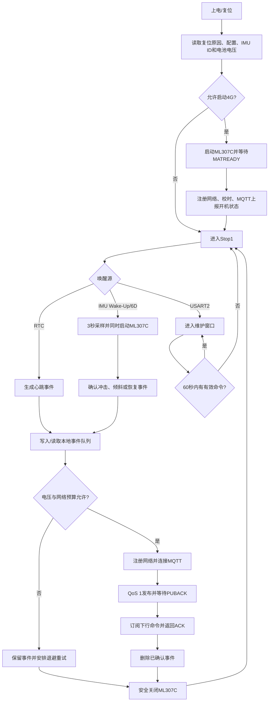

# Solar IMU 路牌倾倒监测终端

版本：`7.21`  ·  日期：`2026-07-21`

本项目是一套面向室外路牌、道路附属设施和太阳能设备的低功耗倾倒/冲击监测固件。STM32G031 负责低功耗状态机和数据采集，LSM6DS3TR-C 负责 Wake-Up 与 6D 姿态唤醒，ML307C-GC-CN 负责 4G、GNSS/LBS 和 MQTT 上报。

当前版本已经完成实机验证：

- LSM6DS3TR-C Wake-Up 与 6D 共用 INT1，可分别识别冲击和缓慢倾倒。
- STM32G031 可由 IMU、RTC 和维护串口从 Stop1 唤醒。
- IMU 唤醒后连续采样 3 秒，同时启动 ML307C，完成 MQTT 上报后重新进入 Stop1。
- 事件先写入最多 3 条的 Flash 队列，网络失败后按退避策略重传。
- MQTT 上行使用 QoS 1 并等待 PUBACK；`event_id`用于服务端去重。
- USART2 使用带长度、序号、CRC16和帧尾的二进制维护协议。
- USART2 已通过30轮Stop1边界、64字节负载、16帧突发、4096字节噪声及错误波特率恢复测试。

> 当前 MQTT `1883`端口和共享账号仅用于开发测试。量产版本必须改用 TLS、独立设备凭据，并且不能把 IMEI 当作认证密钥。

## 1. 硬件组成

| 模块 | 型号/接口 | 作用 |
|---|---|---|
| MCU | STM32G031，64 KB Flash，8 KB RAM | 主状态机、低功耗、ADC、RTC、事件存储 |
| 4G/GNSS | ML307C-GC-CN，USART1 115200 bit/s | 蜂窝联网、MQTT、网络校时、GNSS/LBS |
| IMU | LSM6DS3TR-C，I2C2 | 加速度、角速度、Wake-Up、6D姿态检测 |
| 维护串口 | USART2，PA2/PA3，115200-8-N-1 | 配置、诊断、队列读取、人工上报 |
| IMU中断 | PB1 / EXTI0_1 | LSM6DS3TR-C INT1，上升沿唤醒 |
| 4G控制 | PB3/PB4/PB8 | RESET、PWRKEY、STATE |

USART1使用PB6/PB7并配合DMA接收ML307C数据。USART2使用PA2/PA3连接CH340等USB转串口模块。

## 2. 默认参数

| 参数 | 默认值 | 说明 |
|---|---:|---|
| Wake-Up阈值 | 500 mg | 冲击/运动检测阈值 |
| 倾斜阈值 | 30° | 相对固定安装轴的报警角度 |
| RTC心跳周期 | 3600 s | 无事件时的周期上报间隔 |
| 低压阈值 | 3550 mV | 低于该值禁止启动4G |
| 临界电压 | 3350 mV | 低于该值跳过当前联网发送 |
| Flash安全写入电压 | 3450 mV | 低于该值拒绝清空事件队列 |
| IMU事件采样 | 3000 ms | 唤醒后采样窗口 |
| 倾斜确认时间 | 500 ms | 连续超过阈值才确认倾斜 |
| 串口维护超时 | 60 s | 无有效维护活动后重新休眠 |
| 本地事件队列 | 3条 | 避免64 KB Flash被事件占满 |

配置保存在RTC备份寄存器中。设备安装零度轴可设置为`Z+、Z-、X+、X-、Y+、Y-`。

## 3. 运行流程



### 3.1 IMU低功耗工作点

- Stop1期间加速度计保持52 Hz，用于Wake-Up和6D检测。
- Stop1期间陀螺仪关闭。
- 事件唤醒后加速度计和陀螺仪恢复104 Hz，连续采样3秒。
- Wake-Up和6D同时路由至锁存、高有效、推挽输出的INT1，`MD1_CFG=0x24`。
- 固件读取`WAKE_UP_SRC`和`D6D_SRC`释放INT1锁存，再清除STM32 EXTI挂起位。

### 3.2 倾角零度定义

倾角不是相对上一次姿态计算，而是相对用户指定的固定安装轴计算：

| mount_axis | 安装零度方向 |
|---:|---|
| 0 | Z+，PCB正面朝上平放 |
| 1 | Z- |
| 2 | X+ |
| 3 | X- |
| 4 | Y+ |
| 5 | Y- |

例如设备安装后重力方向为Y+，应设置`mount_axis=4`，此安装姿态即为0°。

### 3.3 网络失败退避

- 第一次失败：5分钟后重试。
- 第二次失败：15分钟后重试。
- 后续失败：60分钟后重试。
- 低电量导致的失败：6小时后重试。
- 连续网络异常会触发ML307C硬复位保护。

## 4. MQTT协议

设备IMEI仅作为设备编号、Client ID和主题隔离依据。

| 方向 | Topic | QoS | 说明 |
|---|---|---:|---|
| 上行 | `device/<IMEI>/data` | 1 | 事件、心跳、开机状态 |
| 下行 | `device/<IMEI>/cmd` | 1 | 服务器配置命令 |
| 上行ACK | `device/<IMEI>/ack` | 1 | 下行命令执行确认 |

### 4.1 上报JSON

示例：

```json
{
  "id": 97,
  "ts": 1784611601,
  "v": 3971,
  "w": 2,
  "fl": 3,
  "tilt": [6317, 6577, 6940],
  "acc": {
    "f": [-70, 917, 413],
    "p": [130, 969, 471],
    "n": 1036
  },
  "gyro": {
    "f": [0, -3, -1],
    "p": [67, 77, 56]
  },
  "sn": 300,
  "rst": 6,
  "r": 0,
  "lbs": [460, 0, 22549, 201822278],
  "time": "2026-07-21T05:26:41",
  "err": 0
}
```

字段说明：

| 字段 | 单位/含义 |
|---|---|
| `id` | 事件ID；QoS 1重复消息以此字段去重 |
| `ts` | Unix时间戳 |
| `v` | 电池电压，mV |
| `w` | 唤醒原因：0未知、1 Wake-Up、2 6D、3两者、4 RTC、5人工/开机 |
| `fl` | 事件位：`0x01`时间有效、`0x02`倾斜、`0x04`冲击、`0x08`恢复 |
| `tilt` | `[开始角度, 最终角度, 峰值角度]`，单位0.01° |
| `acc.f` | 最终三轴加速度，mg |
| `acc.p` | 三轴绝对峰值加速度，mg |
| `acc.n` | 最大加速度模长，mg |
| `gyro.f` | 最终三轴角速度，dps |
| `gyro.p` | 三轴绝对峰值角速度，dps |
| `sn` | 采样数量 |
| `rst` | STM32复位原因 |
| `r` | 当前事件重试次数 |
| `gps` | `[纬度×10000, 经度×10000, 卫星数]`，定位成功时出现 |
| `lbs` | `[MCC, MNC, TAC, Cell ID]`，GNSS失败时使用 |
| `loc` | GPS和LBS均失败时为`null` |
| `time` | RTC时间字符串 |
| `err` | 失败原因：0无、1低压、2模块未就绪、3 SIM、4网络、5 MQTT连接、6 PUBACK、7 GNSS、8内部错误 |

MQTTX显示的订阅QoS可能为0，但设备侧`AT+MQTTPUB`使用QoS 1并等待`+MQTTURC: "puback"`。

### 4.2 MQTT下行配置

服务器向`device/<IMEI>/cmd`发布：

```json
{
  "cmd_id": 123,
  "ver": 1,
  "exp": 1780000000,
  "wu": 500,
  "tilt": 30,
  "mount": 0,
  "sleep": 3600,
  "vlow": 3550
}
```

- `cmd_id`必须递增，重复命令会被忽略。
- `ver`当前必须为1。
- `exp`必须晚于设备当前时间。
- 执行成功后向`device/<IMEI>/ack`发布：

```json
{"cmd_id":123,"ok":1}
```

## 5. USART2二进制维护协议

串口参数：`115200 bit/s，8数据位，无校验，1停止位，无流控`。串口助手必须使用十六进制发送和十六进制显示。

完整协议细节也见[`docs/service_protocol.md`](docs/service_protocol.md)。

### 5.1 Stop1唤醒握手

STM32G031在Stop1期间不能直接接收完整USART2帧，PA3会临时切换为下降沿EXTI。因此第一字节只能用于物理唤醒，不能携带命令。

正确流程：

1. 单独发送唤醒令牌：

   ```text
   00
   ```

2. 等待READY响应：

   ```text
   55 AA 01 FF 00 01 00 00 2F 26 0D 0A
   ```

3. 收到READY后，再发送一条完整命令帧。
4. 必须等待该命令的响应后，才能发送下一条状态改变命令。

`00`和命令帧不能在同一批数据中连续发送。单独的`55`没有协议含义，`55`只能作为`55 AA`帧头的第一个字节。

设备已醒时发送`00`也会返回同一个READY响应，因此上位机不需要预先判断设备状态。

### 5.2 帧结构

| 字段 | 字节数 | 说明 |
|---|---:|---|
| Header | 2 | 固定`55 AA` |
| Version | 1 | 当前`01` |
| Command | 1 | 请求功能码；响应为`Command OR 0x80` |
| Sequence | 1 | 0~255，由请求指定，响应原样返回 |
| Length | 2 | Payload长度，小端，最大64字节 |
| Payload | N | 命令参数或响应数据 |
| CRC16 | 2 | CRC16-CCITT，小端 |
| Tail | 2 | 固定`0D 0A` |

CRC覆盖范围：`Version + Command + Sequence + Length + Payload`。CRC初始值为`0xFFFF`，多项式为`0x1021`；不包含帧头、CRC字段和帧尾。

响应Payload的第一个字节固定为状态码：

| 状态码 | 含义 |
|---:|---|
| `00` | 成功 |
| `01` | CRC错误或协议版本错误 |
| `02` | 长度错误 |
| `03` | 不支持的功能码 |
| `04` | 参数值或队列索引无效 |
| `05` | 系统正忙，例如正在完成4G上报 |
| `06` | 操作失败 |

### 5.3 CRC参考代码

```python
def crc16_ccitt(data: bytes) -> int:
    crc = 0xFFFF
    for value in data:
        crc ^= value << 8
        for _ in range(8):
            crc = ((crc << 1) ^ 0x1021) & 0xFFFF if crc & 0x8000 \
                  else (crc << 1) & 0xFFFF
    return crc

def build_frame(command: int, sequence: int, payload: bytes = b"") -> bytes:
    body = bytes((0x01, command, sequence))
    body += len(payload).to_bytes(2, "little") + payload
    return (b"\x55\xAA" + body
            + crc16_ccitt(body).to_bytes(2, "little")
            + b"\x0D\x0A")
```

## 6. USART2命令详解

以下示例均可直接用十六进制串口助手发送。实际使用前仍应先执行`00 → READY`握手。

### 6.1 GET_STATUS：读取设备状态

- 功能码：`01`
- 请求Payload：空
- 作用：读取电压、事件队列、4G状态、低压熔断、看门狗、串口错误、最近一次上报和RTC/IMU诊断计数。

请求，Sequence=`01`：

```text
55 AA 01 01 01 00 00 D9 FA 0D 0A
```

正常响应形式：

```text
55 AA 01 81 01 40 00 00 <63字节状态数据> <CRC16> 0D 0A
```

响应状态数据按小端排列：

```text
voltage_mv:u16
queue_count:u8
modem_on:u8
low_voltage_fuse:u8
iwdg_runs_in_stop:u8
vlow_mv:u16
sleep_sec:u32
imu_ok:u8
reset_reason:u8
rx_drop_count:u16
partial_timeout_count:u16
uart_error_count:u16
last_report_ok:u8
last_report_stage:u8
last_report_fail:u8
csq:u8
attached:u8
report_duration_ms:u32
rtc_arm_status:u8
rtc_arm_count:u16
rtc_hw_wake_count:u16
rtc_callback_count:u16
rtc_interval_sec:u16
rtc_cr:u32
rtc_sr:u32
rtc_deactivate_status:u8
rtc_timer_active:u8
rtc_accum_sec:u32
rtc_requested_sec:u32
rtc_consumed_count:u16
rtc_ready_count:u16
imu_exti_wake_count:u16
imu_source_fallback_count:u8
```

`last_report_stage`：0空闲、1采样、2模块就绪、3 IMEI、4网络、5 RTC、6 MQTT连接、7定位、8发布、9事件队列、10下行、11关机、12完成。

### 6.2 RUN_REPORT：人工触发一次完整上报

- 功能码：`02`
- 请求Payload：空
- 作用：启动3秒采样、4G联网、定位和MQTT上报。命令只确认任务已接受，上报结果通过MQTT和GET_STATUS查看。

请求：

```text
55 AA 01 02 02 00 00 55 38 0D 0A
```

正常响应：

```text
55 AA 01 82 02 01 00 00 BB F7 0D 0A
```

正在上报时返回状态`05 BUSY`。

### 6.3 SET_CONFIG：设置工作参数

- 功能码：`03`
- 请求Payload：10字节

```text
wu_mg:u16 + tilt_deg:u16 + sleep_sec:u32 + vlow_mv:u16
```

参数范围：

- `wu_mg`：250~2000 mg
- `tilt_deg`：10~90°
- `sleep_sec`：10~65535 s
- `vlow_mv`：3500~4000 mV

示例设置500 mg、30°、3600 s、3550 mV：

```text
55 AA 01 03 03 0A 00 F4 01 1E 00 10 0E 00 00 DE 0D D4 53 0D 0A
```

正常响应：

```text
55 AA 01 83 03 01 00 00 5E 2B 0D 0A
```

成功后立即重配IMU并保存配置。

### 6.4 READ_QUEUE：读取本地事件队列

- 功能码：`04`
- 请求Payload：可为空，或包含一个`index:u8`
- 作用：读取网络失败后保存在内部Flash中的事件。索引0为最旧事件。

读取索引0：

```text
55 AA 01 04 04 00 00 6C AD 0D 0A
```

正常响应形式：

```text
55 AA 01 84 04 <Length> 00 <queue_count> <index> <52字节EventRecord_t> <CRC16> 0D 0A
```

队列为空或索引不存在时返回状态`04`。

### 6.5 CLEAR_QUEUE：清空本地事件队列

- 功能码：`05`
- 请求Payload：空
- 作用：擦除所有未上报事件。
- 注意：这是数据删除操作；电压低于3450 mV时会被拒绝，返回状态`06`。

请求：

```text
55 AA 01 05 05 00 00 E8 EC 0D 0A
```

正常响应：

```text
55 AA 01 85 05 01 00 00 42 C1 0D 0A
```

### 6.6 SLEEP：立即进入Stop1

- 功能码：`06`
- 请求Payload：空
- 作用：关闭ML307C、退出维护会话，在ACK发送完成后进入Stop1。

请求：

```text
55 AA 01 06 06 00 00 64 2E 0D 0A
```

正常响应：

```text
55 AA 01 86 06 01 00 00 4C B4 0D 0A
```

收到ACK后设备不会主动再发送READY。下一次维护必须重新发送`00`唤醒令牌。

### 6.7 MODEM_ON：打开ML307C

- 功能码：`07`
- 请求Payload：空
- 作用：执行硬件PWRKEY开机流程。
- 限制：低压熔断有效时返回状态`06`。

请求：

```text
55 AA 01 07 07 00 00 E0 6F 0D 0A
```

正常响应：

```text
55 AA 01 87 07 01 00 00 A9 68 0D 0A
```

### 6.8 MODEM_OFF：关闭ML307C

- 功能码：`08`
- 请求Payload：空
- 作用：执行MQTT断开和ML307安全关机流程；必要时通过PWRKEY关闭。

请求：

```text
55 AA 01 08 08 00 00 3F 97 0D 0A
```

正常响应：

```text
55 AA 01 88 08 01 00 00 BE D9 0D 0A
```

### 6.9 GET_IMU_DIAG：读取IMU配置和中断计数

- 功能码：`09`
- 请求Payload：空
- 作用：检查Wake-Up/6D寄存器、安装方向、阈值和中断源计数。

请求：

```text
55 AA 01 09 09 00 00 BB D6 0D 0A
```

正常响应形式：

```text
55 AA 01 89 09 16 00 00 <21字节诊断数据> <CRC16> 0D 0A
```

状态字节后的数据结构：

```text
CTRL1_XL:u8
CTRL8_XL:u8
CTRL10_C:u8
TAP_CFG:u8
TAP_THS_6D:u8
WAKE_UP_THS:u8
WAKE_UP_DUR:u8
MD1_CFG:u8
mount_axis:u8
tilt_deg:u16
wu_mg:u16
false_wake_count:u16
wu_source_count:u16
d6d_source_count:u16
both_source_count:u16
```

500 mg、30°、Z+安装时，前8个寄存器通常为：

```text
30 01 00 81 40 10 00 24
```

### 6.10 SET_MOUNT：设置安装零度轴

- 功能码：`0A`
- 请求Payload：`mount_axis:u8`
- 取值：0=Z+、1=Z-、2=X+、3=X-、4=Y+、5=Y-

设置Z+：

```text
55 AA 01 0A 0A 01 00 00 85 52 0D 0A
```

正常响应：

```text
55 AA 01 8A 0A 01 00 00 55 70 0D 0A
```

### 6.11 WAKE/READY：设备就绪通知

- 功能码：`7F`，仅由设备生成。
- 响应功能码：`FF`
- 作用：表示STM32已从Stop1恢复USART2，可以接收完整命令帧。

主机发送：

```text
00
```

设备正常返回：

```text
55 AA 01 FF 00 01 00 00 2F 26 0D 0A
```

## 7. 构建与烧录

工程支持STM32CubeIDE生成文件和CMake/Ninja构建。

```powershell
cmake --preset Debug
cmake --build --preset Debug --parallel 8
```

当前Debug构建资源占用：

- Flash：约45.7 KB / 60 KB应用区，约74%。
- RAM：6848 B / 8 KB，约83.6%。

生成的ELF位于：

```text
build/Debug/solar_imu.elf
```

转换BIN：

```powershell
arm-none-eabi-objcopy -O binary build/Debug/solar_imu.elf build/Debug/solar_imu.bin
```

## 8. 主要源码

| 文件 | 作用 |
|---|---|
| `Core/Src/main.c` | 系统状态机、Stop1、RTC、事件确认、上报流程 |
| `Core/Src/lsm6ds.c` | LSM6DS3TR-C采样、Wake-Up、6D、INT1锁存处理 |
| `Core/Src/at_ml307c.c` | ML307C开关机、AT、注册、MQTT、GNSS/LBS |
| `Core/Src/uart_driver.c` | 环形缓冲/DMA UART驱动 |
| `Core/Src/service_protocol.c` | USART2二进制协议、CRC、半包/粘包/队列 |
| `Core/Src/event_store.c` | 最多3条Flash事件队列 |
| `docs/service_protocol.md` | USART2协议字段级说明 |

## 9. 量产前必须完成的事项

- MQTT改为TLS端口并为每台设备签发独立凭据或证书。
- IMEI只作为设备编号；后台建立产品序列号、MCU UID、IMEI、ICCID和设备凭据映射。
- 对外壳防水、防凝露、ESD/EFT、浪涌、反接、过压和温度范围进行整机验证。
- 在最低电池电压、弱信号和基站切换条件下验证ML307C峰值电流和储能裕量。
- 量产烧录时写入设备档案，并在服务器完成首次注册和唯一性校验。
- 校准每种安装方向，记录零度轴和允许倾斜阈值。
- 服务端必须按`event_id`进行QoS 1重复消息去重，并对设备离线/低电量建立超时告警。
- 当前64 KB Flash不适合双镜像OTA；升级以USART2/SWD现场烧录为主。

## 10. 已知限制

- RTC使用LSI，长周期时间精度不如外部LSE；联网成功后由ML307C校时。
- Stop1下USART2第一字节必然可能丢失，因此必须执行`00 → READY → 完整帧`两阶段握手。
- 本地Flash队列只有3条，长时间断网时只能保留有限数量的最新关键事件。
- 当前测试Broker为明文连接，不可直接作为量产安全方案。
- 链接器仍提示RWX LOAD segment警告，当前可运行，但正式发布前应进一步收紧链接段权限。
