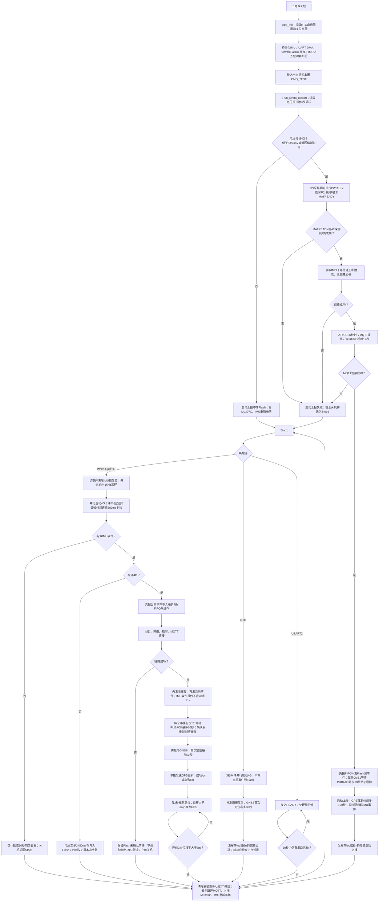

# Solar IMU 路牌倾倒监测终端

版本：`7.22`  ·  日期：`2026-08-16`

本项目是一套面向室外路牌、道路附属设施和太阳能设备的低功耗倾倒/冲击监测固件。STM32G031 负责低功耗状态机和数据采集，LSM6DS3TR-C 负责 Wake-Up 与 6D 姿态唤醒，ML307C-GC-CN 负责 4G、GNSS 和 MQTT 上报。

当前版本已经完成实机验证：

- LSM6DS3TR-C Wake-Up 与 6D 共用 INT1；Stop1 返回后原子采集 EXTI 硬件挂起位，避免中断已到达却未分类。
- IMU来源寄存器读为unknown、但Stop1期间已确认INT1边沿时，按本板实测规则归类为6D倾角事件。
- 开机首报执行一次GPS首定位；首定位期间是安装宽限期，工人安装产生的IMU活动会被彻底丢弃，首报结束后才重新布防监测。
- STM32G031 可由 IMU、RTC 和维护串口从 Stop1 唤醒。
- IMU 唤醒后连续采样 3 秒，同时启动 ML307C，完成 MQTT 上报后重新进入 Stop1。
- IMU事件先写入最多 2 条的 Flash 双缓存；网络失败后立即关机，在下一次正常心跳或IMU事件时按时间顺序补发。
- MQTT 上行使用 QoS 1 并等待 PUBACK；`event_id`用于服务端去重。
- USART2 使用带长度、序号、CRC16和帧尾的二进制维护协议。
- `pc_tool` 提供 V1.1.1 Windows 上位机源码；支持0.1~2秒实时姿态、六轴数据、IMEI读取、用户单位参数设置及写入后自动回读校验。
- USART2 已通过30轮Stop1边界、64字节负载、16帧突发、4096字节噪声及错误波特率恢复测试。

> 当前 MQTT `1883`端口和共享账号仅用于开发测试。量产版本必须改用 TLS、独立设备凭据，并且不能把 IMEI 当作认证密钥。

## 1. 硬件组成

| 模块 | 型号/接口 | 作用 |
|---|---|---|
| MCU | STM32G031，64 KB Flash，8 KB RAM | 主状态机、低功耗、ADC、RTC、事件存储 |
| 4G/GNSS | ML307C-GC-CN，USART1 115200 bit/s | 蜂窝联网、MQTT、网络校时、GNSS |
| IMU | LSM6DS3TR-C，I2C2 | 加速度、角速度、Wake-Up、6D姿态检测 |
| 维护串口 | USART2，PA2/PA3，115200-8-N-1 | 配置、诊断、队列读取、人工上报 |
| IMU中断 | PB1 / EXTI0_1 | LSM6DS3TR-C INT1，上升沿唤醒 |
| 4G控制 | PB3/PB4/PB8 | RESET、PWRKEY、STATE |

USART1使用PB6/PB7并配合DMA接收ML307C数据。USART2使用PA2/PA3连接CH340等USB转串口模块。

## 2. 默认参数

| 参数 | 默认值 | 说明 |
|---|---:|---|
| Wake-Up阈值 | 500 mg | 默认冲击唤醒阈值 |
| Wake-Up持续时间 | 1 / ODR | 416 Hz监测时约连续2.4 ms超过阈值才触发 |
| 倾斜阈值 | 30° | 相对固定安装轴的报警角度 |
| RTC心跳周期 | 3600 s | 无事件时的周期上报间隔 |
| 低压阈值 | 3550 mV | 低于该值禁止启动4G |
| 临界电压 | 3350 mV | 低于该值跳过当前联网发送 |
| Flash安全写入电压 | 3450 mV | 低于该值拒绝清空事件队列 |
| IMU事件采样 | 3000 ms | 唤醒后采样窗口 |
| 倾斜确认时间 | 500 ms | 连续超过阈值才确认倾斜 |
| 串口维护超时 | 60 s | 无有效维护活动后重新休眠 |
| 本地事件队列 | 2条FIFO双缓存 | 保留最近两条未确认送达的IMU事件 |

配置保存在RTC备份寄存器中。设备安装零度轴可设置为`Z+、Z-、X+、X-、Y+、Y-`。

## 3. 运行流程



### 3.1 实际时序与超时

流程图中的时间均来自当前固件常量和AT驱动，不是上位机的估计值：

| 阶段 | 当前行为与上限 |
|---|---|
| IMU/启动/RTC采样 | 每次`Run_Event_Report()`均采样约3秒；采样周期10ms，倾斜需连续超阈值500ms确认。 |
| ML307C开机 | 采样开始即拉低PWRKEY，低脉冲2.3秒；采样中轮询`+MATREADY`。采样结束若未就绪，再以`AT`探测，额外最多5秒。 |
| 网络 | `ML307C_Wait_Network()`总预算20秒，期间确认注册和`CGATT=1`；失败不会另建快速重试定时器。 |
| MQTT连接 | 配置clean session和120秒keepalive后，等待连接URC最多12秒。 |
| QoS 1发布 | 每条事件、GPS更新和ACK均等待`+MQTTURC: "puback"`，单条最多10秒；未收到PUBACK不删除Flash记录。 |
| 启动上报定位 | MCU上电后的第一条启动上报等待GNSS最多120秒，然后发布完整事件（`loc`为有效定位或`Err*`）。该期间为安装宽限期，所有IMU边沿均在结束时清除，不产生事件上报。 |
| RTC心跳定位 | RTC心跳首次GNSS定位最多60秒，再发布完整心跳；成功后读取一次下行配置。 |
| IMU事件定位 | 先完成不含`loc/lbs`的事件包，再单独等待首次GNSS定位最多60秒；之后每3秒再次查询。连续3次相对上次有效位置的位移不大于5m，结束跟踪并关机。 |
| USART2维护会话 | 单独发送`00`后收到READY；每次有效收发都会续期，连续60秒无活动后关闭4G并回Stop1。 |

> 当前实现的边界：IMU首个GNSS定位有60秒上限；但首个定位成功后，持续跟踪阶段**没有总时长上限**。只要持续检测到大于5m的位移，或后续3秒重查询连续失败导致静止计数被清零，ML307C会保持开启并继续跟踪。这是代码当前的真实行为，而非文档遗漏；量产前建议单独确定“最长跟踪时长/最长连续定位失败次数”并加入硬上限。

### 3.2 IMU事件“先事件、后GPS”的原因

Wake-Up和6D代表碰撞或姿态变化，需要优先把3秒采样得到的电压、倾角变化、加速度峰值和陀螺数据送达。GNSS首次定位可能等待60秒，因此当前固件将两类消息分开：

1. IMU事件确认后先落入Flash双缓存，联网成功即按FIFO发布。该事件JSON**不带**`loc`和`lbs`字段。
2. 每条事件收到QoS 1 PUBACK后才从Flash删除，确保断网或关机不会把事件当作已送达。
3. 随后同一MQTT连接中开始GNSS；不论成功、超时、定位内容无效还是停止GNSS失败，都会发送一条`type:"gps"`的轻量更新，与原事件使用相同`id`和`ts`关联。
4. 若发现持续移动，继续每3秒发送发生超过5m位移的位置；连续3次静止即结束本轮连接。

这意味着服务器应先按`id`保存事件，再把后到的GPS消息合并到同一事件，而不是把第一条IMU事件当作“没有定位”的失败数据。

### 3.3 IMU低功耗工作点

- Stop1期间加速度计保持416 Hz高性能模式，用于Wake-Up和6D检测。
- Stop1期间陀螺仪关闭。
- 事件唤醒后加速度计和陀螺仪均为416 Hz，连续采样3秒；本轮GPS/上报结束前陀螺仪关闭，同时保持WU/6D的INT1路由关闭。
- Wake-Up和6D同时路由至锁存、高有效、推挽输出的INT1，`MD1_CFG=0x24`。
- 固件读取`WAKE_UP_SRC`和`D6D_SRC`释放INT1锁存，再清除STM32 EXTI挂起位；若Stop1期间INT1已确认而两来源位均清零，按6D事件处理。

### 3.4 开机GPS安装宽限期

开机首条`w=4`完整上报会执行一次GPS定位，最多等待120秒，用于记录设备安装后的初始位置。该阶段工人会搬动和调整设备，因此不接受IMU事件：采样结束后会关闭WU/6D路由，首报完成时重新写入当前IMU配置，并清除`WAKE_UP_SRC`、`D6D_SRC`、STM32 EXTI挂起位和`wake_pending`。只有该清理完成后才进入正常Stop1监测。

### 3.5 倾角零度定义

倾角不是相对上一次姿态计算，而是相对用户指定的固定安装轴计算：

| mount_axis | 安装零度方向 |
|---:|---|
| 0 | Z+，PCB正面朝上平放 |
| 1 | Z- |
| 2 | X+ |
| 3 | X- |
| 4 | Y+ |
| 5 | Y- |

例如设备安装后重力方向为Y+，应设置`mount_axis=4`，此安装姿态即为0°。

### 3.6 网络失败处理

- 网络、MQTT或PUBACK失败后，不创建额外RTC重试，立即安全关闭ML307C并回Stop1。
- 关键IMU事件保存在最多2条的Flash FIFO双缓存中；下次原有心跳或下一次IMU事件联网成功后，先发送最旧缓存，再发送新消息。
- 仅当`AT+MPOF=0`后`LTE_STATE`持续高电平超过8秒，才执行RESET硬件兜底；网络失败本身不会触发硬复位。

## 4. MQTT协议

设备IMEI仅作为设备编号、Client ID和主题隔离依据。

| 方向 | Topic | QoS | 说明 |
|---|---|---:|---|
| 上行 | `device/<IMEI>/data` | 1 | 事件、心跳、开机状态 |
| 下行 | `device/<IMEI>/settings` | 1 | 按设备隔离的远程配置主题，JSON不再携带`imei` |
| 上行ACK | `device/<IMEI>/ack` | 1 | 下行命令执行确认 |

### 4.1 上报JSON

示例：

```json
{
  "id": 97,
  "ts": 1784611601,
  "v": 3971,
  "w": 2,
  "fl": 3,
  "tilt": {"p": 138, "r": 14, "y": 25},
  "acc": {
    "f": [-70, 917, 413],
    "p": [130, 969, 471],
    "n": 1036
  },
  "gyro": {
    "f": [0, -3, -1],
    "p": [67, 77, 56]
  },
  "sn": 300,
  "rst": 6,
  "r": 0,
  "loc": [3105123, 12145678, 9],
  "time": "2026-07-21T05:26:41",
  "err": 0
}
```

字段说明：

| 字段 | 单位/含义 |
|---|---|
| `id` | 事件ID；QoS 1重复消息以此字段去重 |
| `ts` | Unix时间戳 |
| `v` | 电池电压，mV |
| `w` | 最终确认的上报类别：0未知、1确认冲击、2确认倾斜/恢复、3确认倾斜且同时确认冲击、4 RTC、5人工/开机。IMU的原始WU/6D锁存位仅用于唤醒和诊断；`w=1/3`还要求3秒采样中相邻10 ms三维加速度变化达到`wu_mg`。 |
| `fl` | 事件位：`0x01`时间有效、`0x02`倾斜、`0x04`冲击、`0x08`恢复 |
| `tilt` | 三轴变换角`{p,r,y}`=pitch绕Y轴、roll绕X轴、yaw绕重力轴，单位0.01°，带符号 |
| `acc.f` | 最终三轴加速度，mg |
| `acc.p` | 三轴绝对峰值加速度，mg |
| `acc.n` | 最大加速度模长，mg |
| `gyro.f` | 最终三轴角速度，dps |
| `gyro.p` | 三轴绝对峰值角速度，dps |
| `sn` | 采样数量 |
| `rst` | STM32复位原因 |
| `r` | 保留字段；当前无定时网络重试，固定为0 |
| `loc` | 定位字段：成功为`[纬度×10000, 经度×10000, 卫星数]`；失败为`"Err0".."Err3"`字符串，Err0=启动命令失败、Err1=等待定位超时、Err2=收到+ MGNSSLOC但数据无效、Err3=定位失败后关闭GNSS失败；IMU事件首包完全省略该字段，其他未尝试定位的完整报告为`null` |
| `time` | RTC本地时间字符串；联网后由ML307C `AT+CCLK`校时，并按时区后缀把UTC转换为本地时间后写入RTC |
| `err` | 失败原因：0无、1低压、2模块未就绪、3 SIM、4网络、5 MQTT连接、6 PUBACK、7 GNSS、8内部错误 |

`tilt`为3秒采样窗口内三轴变换角（单位0.01°，带符号）：`p`=pitch绕Y轴、`r`=roll绕X轴（均由加速度`atan2`计算，变换角=最终-开始），`y`=yaw绕重力轴的角速度积分净变化。倾斜判定仍由固件内部按`tilt_deg`阈值连续500 ms确认，事件只上报三轴变换角，不随事件存储开始/最终角度。

`time`中的本地时间由固件解析`AT+CCLK`的时区后缀（`+zz`）得到：3GPP标准为四分之一小时（如`+32`=UTC+8），部分固件为小时（如`+08`），两者均被支持；RTC存储的是本地时间，`ts`仍是UTC Unix时间戳。

### 4.2 RTC与唤醒定位流程

ML307C单次定位严格按以下顺序执行：

```text
AT+MGNSSCFG="nmea/mask",0
AT+MGNSSLOC=1
AT+MGNSS=2
```

`nmea/mask`为模组NV配置。当前固件在每次模组上电周期第一次定位时确认一次，后续定位不重复写入；后续如取得可靠查询格式，应改为查询后按需写，或移到量产初始化。`+MGNSSLOC:`中仅`fix=2`或`fix=3`视为有效定位。成功时模组自行报告`+MGNSSURC: "state",0`，固件不额外发送`AT+MGNSS=0`；等待超时或收到无效数据时才主动发送`AT+MGNSS=0`。

实机样例`3018.8462N,12020.2967E,...,fix=3,...,07`解析为约`30.314103°N,120.338278°E`、7颗卫星；半球为S/W时纬度/经度为负值。

### 4.2.1 RTC与唤醒定位业务

- RTC周期默认每小时触发一次，网络注册和数据附着等待预算为20秒。RTC完整报告等待GNSS最长3分钟；成功后发送全部既有字段，超时后发送`loc:"Err1"`且`err:7`。
- IMU唤醒后先发送既有事件JSON，但完全省略`loc`/`lbs`字段；随后单独发送轻量GPS消息：

```json
{"type":"gps","id":97,"ts":1784611601,"loc":[3105123,12145678,9]}
```

定位失败时发送：

```json
{"type":"gps","id":97,"ts":1784611601,"loc":"Err1","err":7}
```

- 初次唤醒定位最长等待3分钟。定位成功后每3秒检测；与上一有效位置相比，连续3次移动距离均不超过5米时关闭4G。任一次超过5米会清零静止计数、发送GPS更新并保持4G继续跟踪。

MQTT `loc`字段仍使用现有协议兼容编码`[纬度×10000, 经度×10000, 卫星数]`，因此约损失到`0.0001°`分辨率（纬度约11.1米、北纬30°经度约9.6米）；本次GNSS修复不改变该协议。产品事件链保持GPS-only，LBS兜底仍未启用；维护测试路径的LBS尝试仅用于诊断。

MQTTX显示的订阅QoS可能为0，但设备侧`AT+MQTTPUB`使用QoS 1并等待`+MQTTURC: "puback"`。

### 4.3 MQTT远程配置

设备按 IMEI 隔离远程配置主题：

```text
device/<IMEI>/settings
```

每次 RTC 周期上报成功后，设备会订阅一次本机 settings 主题并等待配置消息。MQTTX/服务端应使用 QoS 1；建议启用 Retain，使设备在下一次 RTC 联网时能够收到最新配置。`device/+/data` 可观察多台设备的上报，`/device/+/data` 是另一个不同主题，前导斜杠必须按实际输入处理。

完整配置示例（不再携带 `imei`）：

```json
{
  "cmd_id": 1760000000,
  "ver": 1,
  "sleep": 3600,
  "tilt": 30,
  "wu": 750
}
```

`cmd_id`示例值仅用于说明格式；实际发布时必须替换为发布瞬间的UTC Unix时间戳。

字段说明：

|---|---:|---|
| `cmd_id` | 是 | UTC Unix时间戳（秒）；必须处于设备当前时间前后7200秒（含边界）内，且大于上次已执行时间戳 |
| `ver` | 是 | 协议版本，当前固定为`1` |
| `sleep` | 否 | RTC周期唤醒时间，600~65535秒；默认3600秒，修改后从本次配置生效时重新计时 |
| `tilt` | 否 | 角度唤醒阈值，10~90度 |
| `wu` | 否 | 加速度唤醒阈值，250~2000 mg |

`sleep`、`tilt`、`wu`允许部分更新，但一条消息必须至少包含一个配置字段。只修改RTC唤醒周期的示例：

```json
{
  "cmd_id": 1760000001,
  "ver": 1,
  "sleep": 1800
}
```

只修改角度和加速度阈值的示例：

```json
{
  "cmd_id": 1760000002,
  "ver": 1,
  "tilt": 25,
  "wu": 600
}
```

处理规则：

1. 设备先确认收到消息的 Topic 完全等于本机的 `device/<IMEI>/settings`。
2. 设备校验 `cmd_id`、`ver` 和所有已提供的配置字段；`cmd_id` 必须是当前UTC时间前后7200秒（含边界）内的Unix时间戳，并且大于上次已执行时间戳。任意字段不符合要求时，整条消息都不会应用。
3. 校验通过后一次性保存配置和 `cmd_id` 到 RTC 备份寄存器，并立即重新配置 IMU 唤醒阈值。
4. `sleep` 发生变化时清零当前 RTC 累计时间，下一周期从配置生效时开始计算。
5. Retain 消息在设备每次 RTC 联网时可能再次收到；设备拒绝 `cmd_id` 小于或等于已执行时间戳的消息，防止重复执行和旧配置回滚。由于 `cmd_id` 还受当前时间前后两小时限制，服务端应在发布时使用真实UTC Unix时间戳，并在成功处理后清理或替换 retained 配置。

执行成功后，设备向以下Topic发布QoS 1确认：

```text
device/<IMEI>/ack
```

ACK示例：

```json
{"cmd_id":1760000000,"ok":1,"ts":1760000051,"wu":750,"tilt":30,"sleep":1800}
```

ACK中的`wu`、`tilt`和`sleep`始终表示设备当前实际生效的加速度阈值、角度阈值和RTC唤醒周期。成功ACK返回应用后的新值；失败ACK返回配置未被修改时仍在使用的当前值。`ts`是设备生成ACK瞬间的32位UTC Unix时间戳（秒），表示设备的实际处理时刻；它不同于`cmd_id`（命令创建时刻），也不同于事件JSON中的本地时间字符串`time`。`ts`依赖设备先完成`AT+CCLK`网络校时；设备RTC未校时（仍为出厂默认）时该值无意义，且`cmd_id`时间窗校验也会失败。

如果消息已经确认属于本机且`cmd_id`是合法正整数，但后续校验失败，设备会向同一ACK Topic发布失败确认：

```json
{"cmd_id":1760000000,"ok":0,"err":5,"ts":1760000051,"wu":750,"tilt":30,"sleep":3600}
```

`err`错误码如下：

| `err` | 含义 |
|---:|---|
| 1 | 接收/订阅失败（无法关联命令时不发送ACK） |
| 2 | JSON或字段格式错误 |
| 3 | 协议版本不支持 |
| 4 | `cmd_id`重复或过旧 |
| 5 | 配置参数越界/非法 |
| 6 | 没有可更新参数 |
| 7 | Topic不匹配（无法确认是配置命令时不发送ACK） |
| 8 | `cmd_id`不在设备当前UTC时间前后7200秒内 |

订阅失败、等待超时、publish URC无法解析、Topic不是本机 settings 主题或 `cmd_id` 缺失/非法时，不发送失败 ACK，因为设备无法安全地把 ACK 关联到本条命令。失败校验不会修改当前配置或已执行的 `cmd_id`。

MQTTX测试示例：

1. 订阅 `device/867926053214567/ack`，QoS 选择 1。
2. 向 `device/867926053214567/settings` 发布不含 `imei` 的上述配置 JSON，QoS 选择 1 并按需开启 Retain。
3. 等待设备下一次 RTC 周期上报完成。
4. 收到形如 `{"cmd_id":123,"ok":1,"ts":1760000051}` 的 ACK 后，表示 Topic 已定位到该设备、参数校验、持久化和阈值重配置均已执行。

## 5. USART2二进制维护协议

串口参数：`115200 bit/s，8数据位，无校验，1停止位，无流控`。串口助手必须使用十六进制发送和十六进制显示。

中文发送与测试手册见[`docs/USART2串口通信指令手册.md`](docs/USART2串口通信指令手册.md)，协议字段定义也见[`docs/service_protocol.md`](docs/service_protocol.md)。

### 5.1 Stop1唤醒握手

STM32G031在Stop1期间不能直接接收完整USART2帧，PA3会临时切换为下降沿EXTI。因此第一字节只能用于物理唤醒，不能携带命令。

正确流程：

1. 单独发送唤醒令牌：

   ```text
   00
   ```

2. 等待READY响应：

   ```text
   55 AA 01 FF 00 01 00 00 2F 26 0D 0A
   ```

3. 收到READY后，再发送一条完整命令帧。
4. 必须等待该命令的响应后，才能发送下一条状态改变命令。

`00`和命令帧不能在同一批数据中连续发送。单独的`55`没有协议含义，`55`只能作为`55 AA`帧头的第一个字节。

设备已醒时发送`00`也会返回同一个READY响应，因此上位机不需要预先判断设备状态。

### 5.2 帧结构

| 字段 | 字节数 | 说明 |
|---|---:|---|
| Header | 2 | 固定`55 AA` |
| Version | 1 | 当前`01` |
| Command | 1 | 请求功能码；响应为`Command OR 0x80` |
| Sequence | 1 | 0~255，由请求指定，响应原样返回 |
| Length | 2 | Payload长度，小端，最大64字节 |
| Payload | N | 命令参数或响应数据 |
| CRC16 | 2 | CRC16-CCITT，小端 |
| Tail | 2 | 固定`0D 0A` |

CRC覆盖范围：`Version + Command + Sequence + Length + Payload`。CRC初始值为`0xFFFF`，多项式为`0x1021`；不包含帧头、CRC字段和帧尾。

响应Payload的第一个字节固定为状态码：

| 状态码 | 含义 |
|---:|---|
| `00` | 成功 |
| `01` | CRC错误或协议版本错误 |
| `02` | 长度错误 |
| `03` | 不支持的功能码 |
| `04` | 参数值或队列索引无效 |
| `05` | 系统正忙，例如正在完成4G上报 |
| `06` | 操作失败 |

### 5.3 CRC参考代码

```python
def crc16_ccitt(data: bytes) -> int:
    crc = 0xFFFF
    for value in data:
        crc ^= value << 8
        for _ in range(8):
            crc = ((crc << 1) ^ 0x1021) & 0xFFFF if crc & 0x8000 \
                  else (crc << 1) & 0xFFFF
    return crc

def build_frame(command: int, sequence: int, payload: bytes = b"") -> bytes:
    body = bytes((0x01, command, sequence))
    body += len(payload).to_bytes(2, "little") + payload
    return (b"\x55\xAA" + body
            + crc16_ccitt(body).to_bytes(2, "little")
            + b"\x0D\x0A")
```

## 6. USART2命令详解

以下示例均可直接用十六进制串口助手发送。实际使用前仍应先执行`00 → READY`握手。

### 6.1 GET_STATUS：读取设备状态

- 功能码：`01`
- 请求Payload：空
- 作用：读取电压、事件队列、4G状态、低压熔断、看门狗、串口错误、最近一次上报和RTC/IMU诊断计数。

请求，Sequence=`01`：

```text
55 AA 01 01 01 00 00 D9 FA 0D 0A
```

正常响应形式：

```text
55 AA 01 81 01 40 00 00 <63字节状态数据> <CRC16> 0D 0A
```

响应状态数据按小端排列：

```text
voltage_mv:u16
queue_count:u8
modem_on:u8
low_voltage_fuse:u8
iwdg_runs_in_stop:u8
vlow_mv:u16
sleep_sec:u32
imu_ok:u8
reset_reason:u8
rx_drop_count:u16
partial_timeout_count:u16
uart_error_count:u16
last_report_ok:u8
last_report_stage:u8
last_report_fail:u8
csq:u8
attached:u8
report_duration_ms:u32
rtc_arm_status:u8
rtc_arm_count:u16
rtc_hw_wake_count:u16
rtc_callback_count:u16
rtc_interval_sec:u16
rtc_cr:u32
rtc_sr:u32
rtc_deactivate_status:u8
rtc_timer_active:u8
rtc_accum_sec:u32
rtc_requested_sec:u32
rtc_consumed_count:u16
rtc_ready_count:u16
imu_exti_wake_count:u16
imu_source_fallback_count:u8
```

`last_report_stage`：0空闲、1采样、2模块就绪、3 IMEI、4网络、5 RTC、6 MQTT连接、7定位、8发布、9事件队列、10下行、11关机、12完成。

### 6.2 RUN_REPORT：人工触发一次完整上报

- 功能码：`02`
- 请求Payload：空
- 作用：启动3秒采样、4G联网、定位和MQTT上报。命令只确认任务已接受，上报结果通过MQTT和GET_STATUS查看。

请求：

```text
55 AA 01 02 02 00 00 55 38 0D 0A
```

正常响应：

```text
55 AA 01 82 02 01 00 00 BB F7 0D 0A
```

正在上报时返回状态`05 BUSY`。

### 6.3 SET_CONFIG：设置工作参数

- 功能码：`03`
- 请求Payload：10字节

```text
wu_mg:u16 + tilt_deg:u16 + sleep_sec:u32 + vlow_mv:u16
```

参数范围：

- `wu_mg`：250~2000 mg
- `tilt_deg`：10~90°
- `sleep_sec`：600~65535 s（默认3600 s）
- `vlow_mv`：3500~4000 mV

示例设置500 mg、30°、3600 s、3550 mV：

```text
55 AA 01 03 03 0A 00 F4 01 1E 00 10 0E 00 00 DE 0D D4 53 0D 0A
```

正常响应：

```text
55 AA 01 83 03 01 00 00 5E 2B 0D 0A
```

成功后立即重配IMU并保存配置。

### 6.4 READ_QUEUE：读取本地事件队列

- 功能码：`04`
- 请求Payload：可为空，或包含一个`index:u8`
- 作用：读取网络失败后保存在内部Flash中的事件。索引0为最旧事件。

读取索引0：

```text
55 AA 01 04 04 00 00 6C AD 0D 0A
```

正常响应形式：

```text
55 AA 01 84 04 <Length> 00 <queue_count> <index> <52字节EventRecord_t> <CRC16> 0D 0A
```

队列为空或索引不存在时返回状态`04`。

### 6.5 CLEAR_QUEUE：清空本地事件队列

- 功能码：`05`
- 请求Payload：空
- 作用：擦除所有未上报事件。
- 注意：这是数据删除操作；电压低于3450 mV时会被拒绝，返回状态`06`。

请求：

```text
55 AA 01 05 05 00 00 E8 EC 0D 0A
```

正常响应：

```text
55 AA 01 85 05 01 00 00 42 C1 0D 0A
```

### 6.6 SLEEP：立即进入Stop1

- 功能码：`06`
- 请求Payload：空
- 作用：关闭ML307C、退出维护会话，在ACK发送完成后进入Stop1。

请求：

```text
55 AA 01 06 06 00 00 64 2E 0D 0A
```

正常响应：

```text
55 AA 01 86 06 01 00 00 4C B4 0D 0A
```

收到ACK后设备不会主动再发送READY。下一次维护必须重新发送`00`唤醒令牌。

### 6.7 MODEM_ON：打开ML307C

- 功能码：`07`
- 请求Payload：空
- 作用：执行硬件PWRKEY开机流程。
- 限制：低压熔断有效时返回状态`06`。

请求：

```text
55 AA 01 07 07 00 00 E0 6F 0D 0A
```

正常响应：

```text
55 AA 01 87 07 01 00 00 A9 68 0D 0A
```

### 6.8 MODEM_OFF：关闭ML307C

- 功能码：`08`
- 请求Payload：空
- 作用：执行MQTT断开和ML307安全关机流程；必要时通过PWRKEY关闭。

请求：

```text
55 AA 01 08 08 00 00 3F 97 0D 0A
```

正常响应：

```text
55 AA 01 88 08 01 00 00 BE D9 0D 0A
```

### 6.9 GET_IMU_DIAG：读取IMU配置和中断计数

- 功能码：`09`
- 请求Payload：空
- 作用：检查Wake-Up/6D寄存器、安装方向、阈值和中断源计数。

请求：

```text
55 AA 01 09 09 00 00 BB D6 0D 0A
```

正常响应形式：

```text
55 AA 01 89 09 16 00 00 <21字节诊断数据> <CRC16> 0D 0A
```

状态字节后的数据结构：

```text
CTRL1_XL:u8
CTRL8_XL:u8
CTRL10_C:u8
TAP_CFG:u8
TAP_THS_6D:u8
WAKE_UP_THS:u8
WAKE_UP_DUR:u8
MD1_CFG:u8
mount_axis:u8
tilt_deg:u16
wu_mg:u16
false_wake_count:u16
wu_source_count:u16
d6d_source_count:u16
both_source_count:u16
```

500 mg、30°、Z+安装时，前8个寄存器通常为：

```text
60 01 04 81 40 10 20 24
```

### 6.10 SET_MOUNT：设置安装零度轴

- 功能码：`0A`
- 请求Payload：`mount_axis:u8`
- 取值：0=Z+、1=Z-、2=X+、3=X-、4=Y+、5=Y-

设置Z+：

```text
55 AA 01 0A 0A 01 00 00 85 52 0D 0A
```

正常响应：

```text
55 AA 01 8A 0A 01 00 00 55 70 0D 0A
```

### 6.11 GET_DEVICE_ID：读取设备身份和上行主题

- 功能码：`0B`
- 请求Payload：空
- 作用：只读返回本次上电周期已缓存的IMEI、STM32唯一UID和当前实际上报的MQTT主题。**不会打开ML307C，不会发送AT命令，也不会产生4G流量。**
- 使用场景：上位机连接后确认设备身份与订阅主题；首次刚上电且4G尚未成功读到IMEI时，仍可读取MCU UID。

请求，Sequence=`0B`：

```text
55 AA 01 0B 0B 00 00 B3 55 0D 0A
```

IMEI已经缓存时，正常响应形式如下。响应Length=`38`，其中第一个`00`是协议状态，后面有55字节身份数据：

```text
55 AA 01 8B 0B 38 00 00 01 <15字节IMEI ASCII> <12字节MCU UID小端> <27字节Topic ASCII> <CRC16> 0D 0A
```

身份数据布局：

| 状态字节后的偏移 | 类型 | 字段 | 说明 |
|---:|---|---|---|
| 0 | u8 | imei_valid | `01`=本次上电已读到有效15位IMEI；`00`=尚无缓存IMEI。 |
| 1 | char[15] | imei | 仅`imei_valid=1`有效，不带字符串结束符。 |
| 16 | u32[3] | mcu_uid | `HAL_GetUIDw0/w1/w2`的小端原始字节；即使无IMEI也始终有效。 |
| 28 | char[27] | mqtt_up_topic | `device/<IMEI>/data`，仅`imei_valid=1`时存在。 |

未取得IMEI时，正常响应Length=`1D`，身份数据仅含前28字节，IMEI字段全为`00`，没有Topic：

```text
55 AA 01 8B 0B 1D 00 00 00 <15字节00> <12字节MCU UID小端> <CRC16> 0D 0A
```

如果设备正在完整上报，仍会回复状态`05 BUSY`；待上报结束后重发本命令即可。因为IMEI只缓存在RAM，若本次上电尚未成功完成IMEI读取，先让一次自动上报或`RUN_REPORT`走到“读取IMEI”阶段即可；后续即使网络或MQTT失败，只要IMEI读取成功，缓存仍然有效。

### 6.12 WAKE/READY：设备就绪通知

- 功能码：`7F`，仅由设备生成。
- 响应功能码：`FF`
- 作用：表示STM32已从Stop1恢复USART2，可以接收完整命令帧。

主机发送：

```text
00
```

设备正常返回：

```text
55 AA 01 FF 00 01 00 00 2F 26 0D 0A
```

## 7. 构建与烧录

工程支持STM32CubeIDE生成文件和CMake/Ninja构建。

```powershell
cmake --preset Debug
cmake --build --preset Debug --parallel 8
```

当前Debug构建资源占用：

- Flash：约45.7 KB / 60 KB应用区，约74%。
- RAM：6848 B / 8 KB，约83.6%。

生成的ELF位于：

```text
build/Debug/solar_imu.elf
```

转换BIN：

```powershell
arm-none-eabi-objcopy -O binary build/Debug/solar_imu.elf build/Debug/solar_imu.bin
```

## 8. 主要源码

| 文件 | 作用 |
|---|---|
| `Core/Src/main.c` | 系统状态机、Stop1、RTC、事件确认、上报流程 |
| `Core/Src/lsm6ds.c` | LSM6DS3TR-C采样、Wake-Up、6D、INT1锁存处理 |
| `Core/Src/at_ml307c.c` | ML307C开关机、AT、注册、MQTT、GNSS |
| `Core/Src/uart_driver.c` | 环形缓冲/DMA UART驱动 |
| `Core/Src/service_protocol.c` | USART2二进制协议、CRC、半包/粘包/队列 |
| `Core/Src/event_store.c` | 最多2条FIFO Flash事件双缓存 |
| `docs/service_protocol.md` | USART2协议字段级说明 |

### 8.1 建议的源码阅读顺序

1. 从 main() 开始，先看外设初始化、启动上报和 while (1) 中的三个动作：维护协议处理、完整上报、Stop1。
2. 阅读 Enter_Stop1_Mode()，理解IMU、RTC、PA3维护唤醒的布防与恢复。Stop1唤醒后从WFI下一行继续，不会重新执行初始化。
3. 阅读 Run_Event_Report()，它是业务总调度入口；再进入 Capture_Event_And_Start_Modem() 查看3秒IMU采样与ML307C开机并行过程。
4. 阅读 lsm6ds.c，重点是 LSM6DS_Config_Gatekeeper()、LSM6DS_Set_Sleep_Mode() 和锁存源寄存器清除。
5. 阅读 at_ml307c.c，调用链为AT就绪、IMEI、网络注册、MQTT连接、QoS 1发布、下行窗口和安全关机。
6. 最后阅读 service_protocol.c、uart_driver.c 和 event_store.c，分别对应维护帧解析、底层串口收发和断网事件持久化。

公共头文件使用Doxygen格式说明函数用途、参数、返回值、调用时机和副作用；源文件补充内部函数、模块静态状态与关键竞态处理。修改接口时应同时更新头文件注释、README协议字段和对应测试脚本。

### 8.2 关键调用关系

~~~text
main while(1)
├─ Service_Task()
│  ├─ ServiceProtocol_Poll()/GetFrame()
│  └─ Handle_Service_Frame()
├─ Run_Event_Report()
│  ├─ Capture_Event_And_Start_Modem()
│  │  ├─ LSM6DS_Set_Active_Mode()/Read_Storage()
│  │  └─ ML307C_Begin_PowerOn()/Poll_MATREADY()
│  ├─ ML307C_Wait_Network()/MQTT_Connect()
│  ├─ EventStore_Get()/Enqueue()/Remove()
│  ├─ ML307C_Send_EventReport()
│  └─ Turn_Off_ML307C()
└─ Enter_Stop1_Mode()
   ├─ LSM6DS_Set_Sleep_Mode()
   ├─ IMU_Drain_INT1_Latch()
   └─ RTC分段布防/WFI/串口引脚恢复
~~~

### 8.3 项目需求与进度

项目需求、进度和长期决策统一记录在 docs/project 目录。后续功能按REQ需求文件完成澄清、实施和验收，当前总进度见 docs/project/PROJECT_STATUS.md。

## 9. 量产前必须完成的事项

- MQTT改为TLS端口并为每台设备签发独立凭据或证书。
- IMEI只作为设备编号；后台建立产品序列号、MCU UID、IMEI、ICCID和设备凭据映射。
- 对外壳防水、防凝露、ESD/EFT、浪涌、反接、过压和温度范围进行整机验证。
- 在最低电池电压、弱信号和基站切换条件下验证ML307C峰值电流和储能裕量。
- 量产烧录时写入设备档案，并在服务器完成首次注册和唯一性校验。
- 校准每种安装方向，记录零度轴和允许倾斜阈值。
- 服务端必须按`event_id`进行QoS 1重复消息去重，并对设备离线/低电量建立超时告警。
- 当前64 KB Flash不适合双镜像OTA；升级以USART2/SWD现场烧录为主。

## 10. 已知限制

- RTC使用LSI，长周期时间精度不如外部LSE；联网成功后由ML307C校时。
- Stop1下USART2第一字节必然可能丢失，因此必须执行`00 → READY → 完整帧`两阶段握手。
- 本地Flash队列只有2条，长时间断网时只能保留最新两条IMU事件。
- 当前测试Broker为明文连接，不可直接作为量产安全方案。
- 链接器仍提示RWX LOAD segment警告，当前可运行，但正式发布前应进一步收紧链接段权限。
